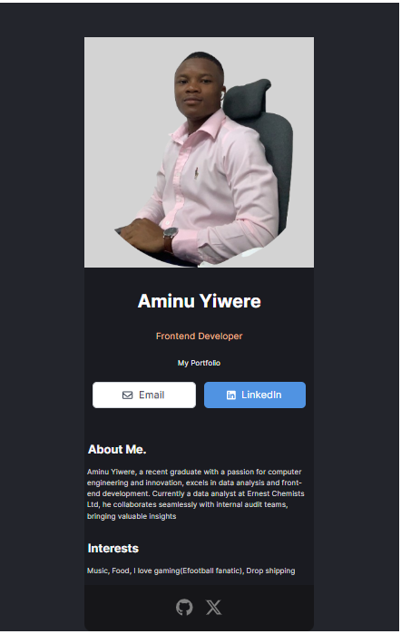

# Business Card Project



This project is a simple business card application built using React and Vite. It showcases information about the user, providing sections for personal details, an about me section, interests, and a footer.

## Table of Contents

- [Getting Started](#getting-started)
  - [Prerequisites](#prerequisites)
  - [Installation](#installation)
- [Usage](#usage)
- [Project Structure](#project-structure)
- [Technologies Used](#technologies-used)
- [Contributing](#contributing)
- [License](#license)
- [Contact](#contact)

## Getting Started

### Prerequisites

Before you begin, ensure you have the following dependencies installed:

- [Node.js](https://nodejs.org/en/)
- [npm](https://www.npmjs.com/)

### Installation

1. Clone the repository:

   ```bash
   git clone https://github.com/yiwereaminu/business-card.git
   ```

2. Navigate to the project directory:

   ```bash
   cd business-card
   ```

3. Install the project dependencies:

   ```bash
   npm install
   ```

## Usage

To run the project, use the following command:

```bash
npm run dev
```

This will start the development server, and you can view the application at [http://localhost:3000](http://localhost:3000).

## Project Structure

The project structure is as follows:

- `src/`: Contains the source code files.
  - `components/`: React components used in the project.
  - `App.jsx`: The main application component.
- `public/`: Public assets and HTML template files.
- `index.css`: Global styles.
- `index.html`: HTML template file.
- `package.json`: Project configuration and dependencies.

## Technologies Used

- React
- Vite
- Bootstrap
- Font Awesome

## Contributing

Contributions are welcome! If you'd like to contribute, please follow our [Contribution Guidelines](CONTRIBUTING.md).

## License

This project is licensed under the [MIT License](LICENSE).

## Contact

For any questions or feedback, feel free to reach out to [Aminu Yiwere](mailto:yiwereamin@gmail.com).
